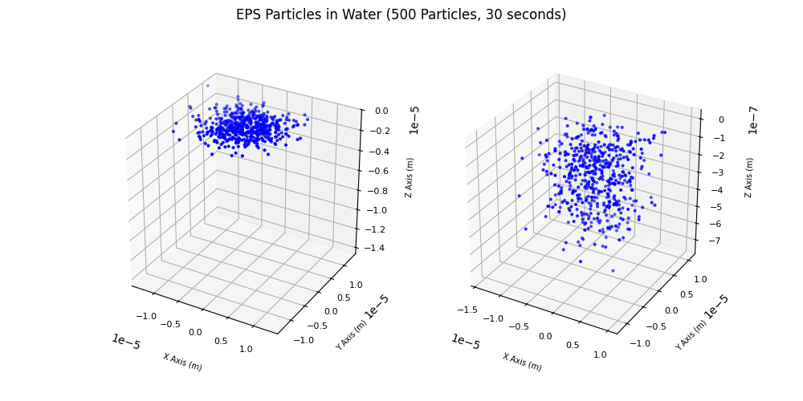
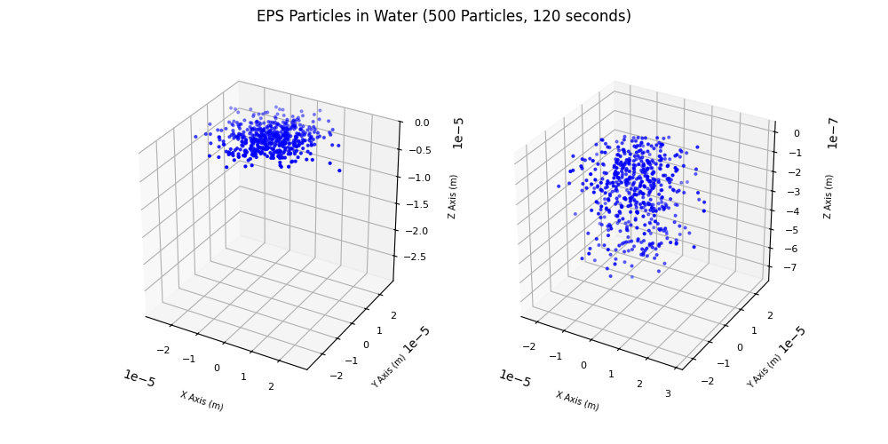
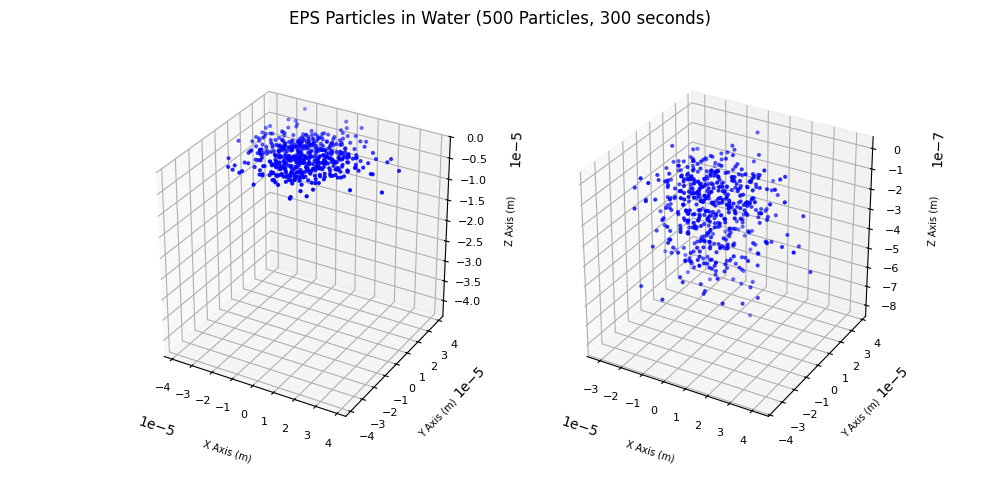
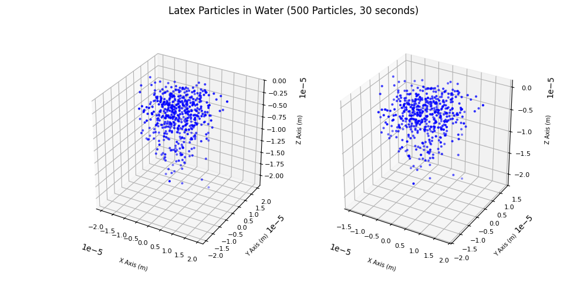
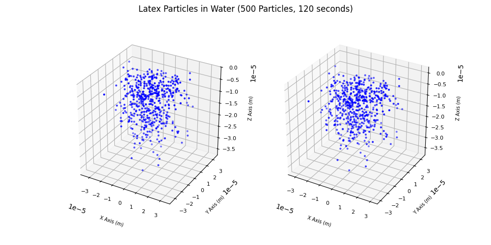
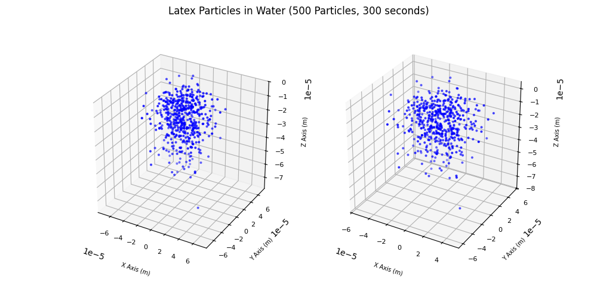
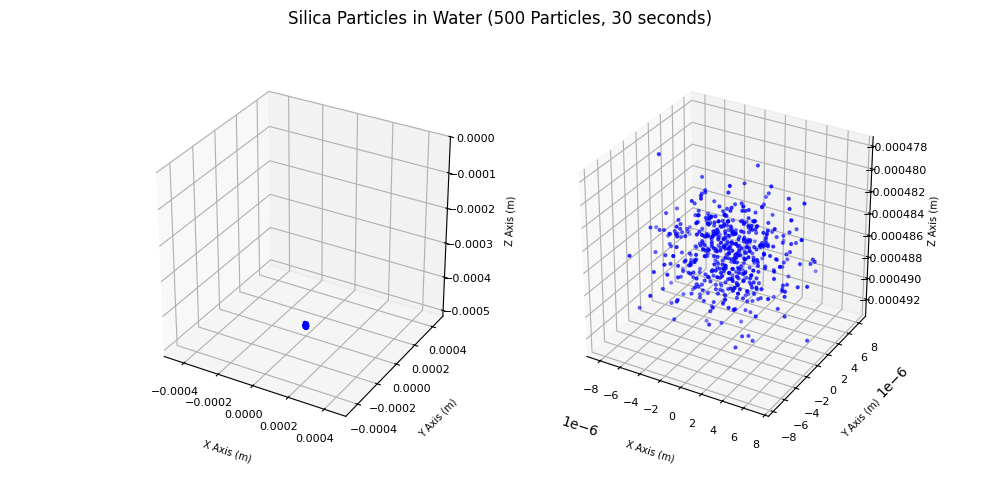
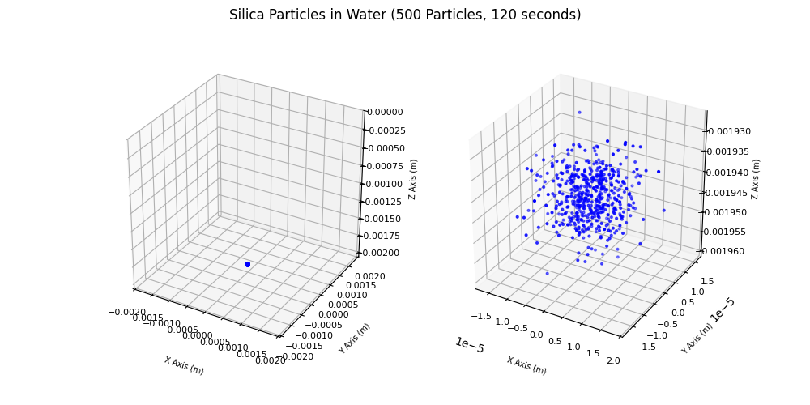
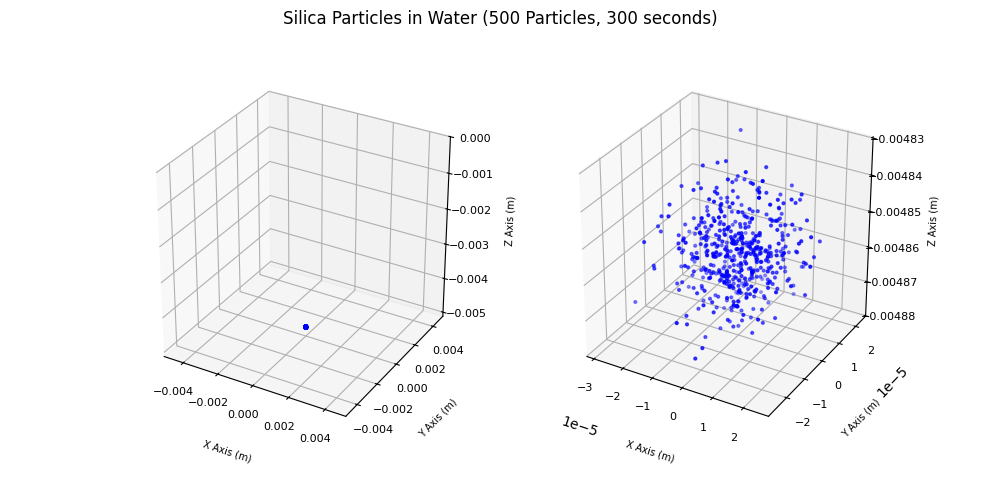

# 랜덤 워크 기반 몬테카를로 시뮬레이션을 이용한 확산 모델 연구

## 개요

## 물리학적 가정

- 입자
  - 입자는 구형이며, 크기는 매우 작아 브라운 운동이 지배적이라고 가정한다.
  - 침강하는 입자는 완벽한 구형(Spherical)이어야 하며, 표면은 매끄럽다고 가정한다.

- 유체
  - 유체는 균일하고 등방성이며, 점성 유체로 가정한다
  - 유체는 뉴턴 유체이며, 균질(Homogeneous)하고 무한히 넓은 공간에 분포한다고 가정한다.
  - 대류, 외부 힘 등의 다른 이동 메커니즘이 발생하지 않는다고 가정한다.

## 시스템 설명

- 시뮬레이션 3차원 공간에서 수행되며, 여러 입자에 대해 독립적으로 수행된다.

### 초기 조건

- 입자의 초기 위치는 원점(0,0,0)으로 설정한다.

### 경계 조선

- x, y 방향은 무한히 확장된 공간으로 가정하여 경계 조건을 적용하지 않는다.
- z=0 (수면)에서 반사 경계 조건을 적용한다. 즉, 입자가 z=0을 넘어서 이동하려고 하면, z=0에서 반사되어 다시 유체 내로 들어오게 된다.
- 압자는 z<=0 (유체 내)에서만 존재한다.

### 입자 이동

- 입자는 유체 내에서 확산과 침강을 동시에 겪는다.
- 입자의 움직임은 일정한 시간 간격으로 업데이트된다.
- 입자의 움직임은 확률적으로 결정되며, 각 시간 간격마다 무작위 방향으로 이동한다.
- 입자는 서로 충돌하지 않으며, 유체와의 상호작용만 고려한다.

## 사용 수식

### 확산 방정식

$\langle r^2(\Delta t) \rangle = 2 d D \Delta t$

- $\langle r^2(\Delta t) \rangle$ : 시간 간격 $\Delta t$에서의 평균 제곱 변위 (m$^2$)
- $d$ : 공간 차원 (1, 2, 또는 3)
- $D$ : 확산 계수 ($m^2/s$)
- $\Delta t$ : 시간 간격 ($s$)

### 확산 계수

$D = \frac{k_B T}{6 \pi \eta r}$

- $D$ : 확산 계수 ($m^2/s$)
- $k_B$ : 볼츠만 상수 ($1.38 \times 10^{-23} J/K$)
- $T$ : 절대 온도 (K)
- $\eta$ : 유체의 점도 (Pa·s = kg/(m·s))
- $r$ : 입자의 반지름 (m)

### Random Walk 평균 제곱 변위 (3차원)

$\langle r^2(n) \rangle = n \cdot l^2$

- $\langle r^2(n) \rangle$ : n 스텝 후의 평균 제곱 변위 ($m^2$)
- $n$ : 스텝 수
- $l$ : 각 스텝의 길이 (m)
- n=1 일 때, $l = \sqrt{6D\Delta t}$

### 침강 속도

$v_{\text{terminal}} = \frac{(m - \rho_{\text{fluid}} V) g}{6 \pi \eta r}$

- $v_{\text{terminal}}$ : 침강 속도 (m/s)
- $m$ : 입자의 질량 (kg)
- $\rho_{\text{fluid}}$ : 유체의 밀도 ($kg/m^3$)
- $V$ : 입자의 부피 ($m^3$)
- $g$ : 중력 가속도 (9.81 $m/s^2$)
- $\eta$ : 유체의 점도 (Pa·s = kg/(m·s))
- $r$ : 입자의 반지름 (m)

## 주요 로직 소개

```python
diffusion_coefficient = BOLTZMANN_CONSTANT * temperature / (6 * PI * fluid_viscosity * particle_radius)  # 확산 계수 D 계산
step_length = (6 * diffusion_coefficient * unit_time) ** 0.5  # 스텝 당 이동 거리 계산
settling_velocity = (particle_mass - fluid_density * particle_volume) * GRAVITY_ACCELERATION / (
        6 * PI * fluid_viscosity * particle_radius)  # 침강 속도 계산
step_count = int(time / unit_time)

particle_positions = []
for _ in range(particle_count):  # 입자 수 만큼 반복
    x, y, z = 0.0, 0.0, 0.0
    for _ in range(step_count):
        theta = random.uniform(0, 2 * PI)  # 랜덤 방향의 θ 고르기
        cos_phi = random.uniform(-1, 1)  # 랜덤 z 방향의 cos(ϕ) 고르기
        phi = math.acos(cos_phi)

        dx = step_length * math.sin(phi) * math.cos(theta)  # dx = dl⋅sin(ϕ)⋅cos(θ)
        dy = step_length * math.sin(phi) * math.sin(theta)  # dy = dl⋅sin(ϕ)⋅sin(θ)
        dz = step_length * cos_phi - settling_velocity * unit_time  # dz = dl⋅cos(ϕ) - vs⋅dt (침강 고려)
        x += dx
        y += dy
        z = - abs(z + dz)  # z 방향이 + 였을 때, z=0 (수면)에서 반사되는 것을 고려
    particle_positions.append([x, y, z])
return particle_positions
```

## 시뮬레이션 결과

- 시뮬레이션 환경
  - 온도 : 298.15K (25℃)
  - 한 스텝 당 시간 간격 : 0.1s
  - 입자 수 : 500개

### 물 & EPS 입자

- 유체 : 밀도 997 $kg/m^3$, 점도 0.00089 $Pa·s$
- 입자 : 밀도 50.0 $kg/m^3$, 반지름 $10^{-6}m$
- 특징 : 유체 밀도 < 입자 밀도

| 실험 진행 시간 |                      시뮬레이션 결과                       |
|:--------:|:---------------------------------------------------:|
|   30s    |  |
|   120s   |  |
|   300s   |  |

### 물 & 라텍스 입자

- 유체 : 밀도 997 $kg/m^3$, 점도 0.00089 $Pa·s$
- 입자 : 밀도 1380.0 $kg/m^3$, 반지름 $10^{-6}m$
- 특징 : 유체 밀도와 입자 밀도와 유사

| 실험 진행 시간 |                       시뮬레이션 결과                        |
|:--------:|:-----------------------------------------------------:|
|   30s    |  |
|   120s   |  |
|   300s   |  |

### 물 & 실리카 입자

- 유체 : 밀도 997 $kg/m^3$, 점도 0.00089 $Pa·s$
- 입자 : 밀도 2650.0 $kg/m^3$, 반지름 $2*10^{-6}m$
- 특징 : 유체 밀도 > 입자 밀도

| 실험 진행 시간 |                        시뮬레이션 결과                        |
|:--------:|:------------------------------------------------------:|
|   30s    |  |
|   120s   |  |
|   300s   |  |
