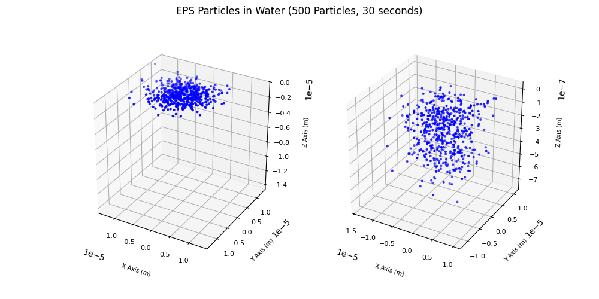
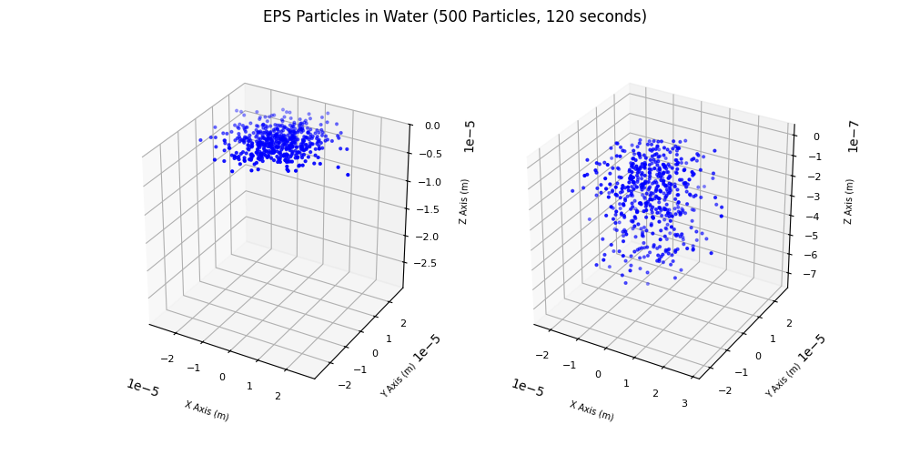
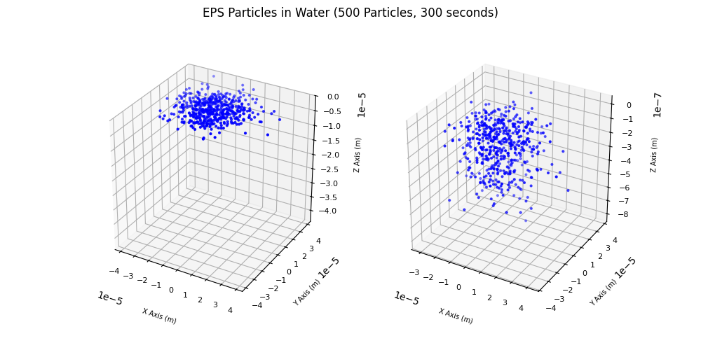
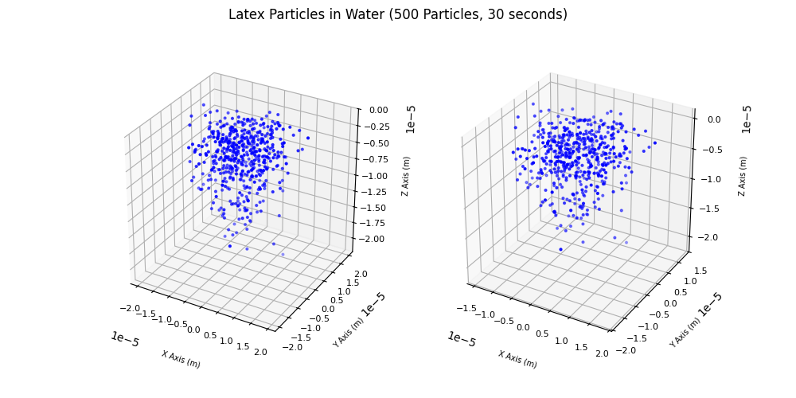
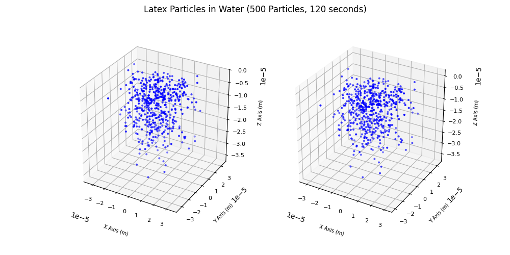
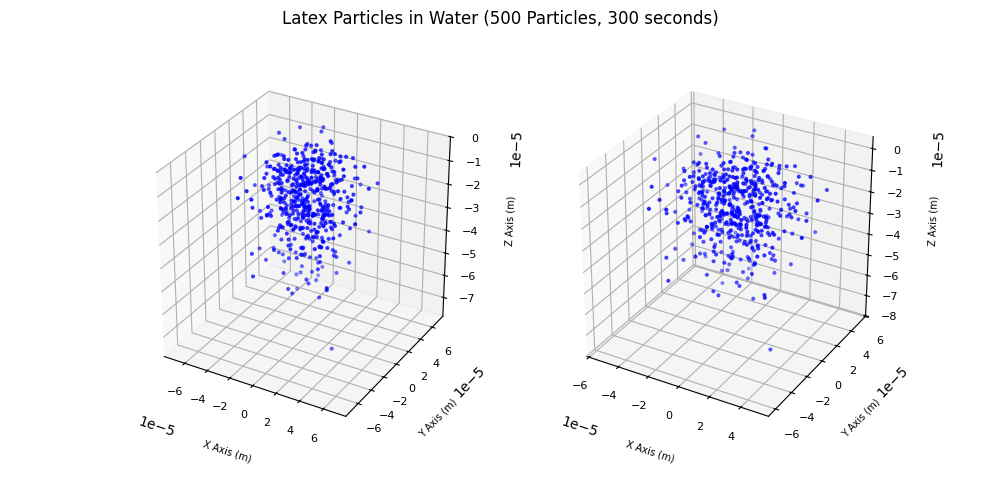
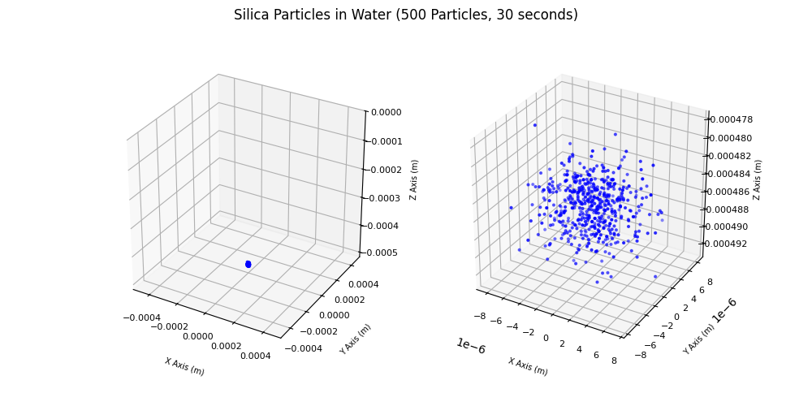
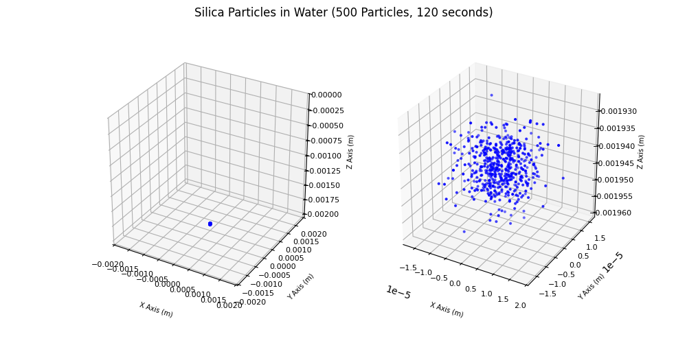
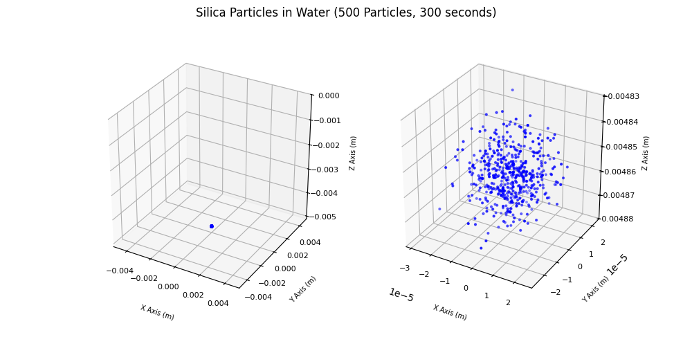

# 랜덤 워크 몬테카를로 시뮬레이션을 활용한 브라운 입자의 확산 및 침강 거동 분석

[완성 논문](./docs/학사학위논문.pdf) | [English version](./README.en.md)

## 개요

이 저장소는 유체 내 마이크로 입자의 확산(브라운 운동)과 침강(스토크스 침강)이 동시에 일어나는 거동을 랜덤 워크 기반 몬테카를로 시뮬레이션으로 분석한 연구의 구현 코드입니다. 입자 밀도와 유체 밀도의 관계가 두 메커니즘의 경쟁에 어떻게 영향을 주는지를 EPS · 라텍스 · 실리카 세 종류의 입자에 대해 3차원 공간에서 시뮬레이션하고, 시간에 따른 분포 변화를 시각화합니다.

## 배경

마이크로 입자는 유체 내에서 브라운 운동에 의한 확산과 중력·부력 차에 의한 침강을 동시에 겪습니다. 두 메커니즘 중 어느 쪽이 지배적인지는 입자의 물성(밀도, 크기)에 따라 달라지며, 이는 환경 모니터링, 콜로이드 분리, 미세 유체 역학 등 여러 응용에서 핵심이 되는 거동입니다.

본 연구는 두 메커니즘을 동시에 포함한 3차원 랜덤 워크 시뮬레이션을 직접 구현하여, 입자 특성이 시간에 따른 공간 분포에 미치는 영향을 정량 분석하고 시각적으로 확인할 수 있도록 합니다.

## 주요 결과

시뮬레이션 환경은 25 ℃의 물 안에 입자 500개, $\Delta t = 0.1\,s$로 고정하고 입자 종류만 바꿔 비교했습니다.

### EPS 입자 (밀도 50 kg/m³, 반지름 1 µm)

입자가 유체보다 훨씬 가벼워 부력이 우세 — 침강이 거의 일어나지 않고 수면(z=0) 근처에서 확산이 지배적.

|   30 s   |  120 s   |  300 s   |
|:--------:|:--------:|:--------:|
|  |  |  |

### 라텍스 입자 (밀도 1380 kg/m³, 반지름 1 µm)

입자가 유체보다 약간 무거움 — 확산과 침강이 비슷한 규모로 경쟁하며 비교적 등방적인 분포.

|   30 s   |  120 s   |  300 s   |
|:--------:|:--------:|:--------:|
|  |  |  |

### 실리카 입자 (밀도 2650 kg/m³, 반지름 2 µm)

입자가 유체보다 무겁고 반지름도 커 침강이 우세 — 시간이 지날수록 z 음의 방향으로 가라앉는 거동이 뚜렷.

|   30 s   |  120 s   |  300 s   |
|:--------:|:--------:|:--------:|
|  |  |  |

## 실행 방법

### 요구사항

- Python 3.11.x
- matplotlib 3.10.x

### 실행

```bash
cd main
python main.py
```

`main.py` 상단의 `PARTICLES`, `FLUIDS`, `TIMES` 리스트를 수정하여 시뮬레이션 시나리오를 변경할 수 있습니다. 결과 이미지는 저장소 루트의 `output/` 디렉토리에 저장됩니다.

## 프로젝트 구조

```
main/
├── constant/    입자·유체 정의 (Particle, Fluid)
├── domain/      시뮬레이션 코어 + 통계 분석 (MSD, RMSD 등)
├── view/        결과 시각화 및 콘솔 출력
└── main.py      엔트리 포인트
docs/
└── simulation-model.md   물리 모델·경계 조건·수식·파라미터 상세
images/                  README에 사용되는 결과 스냅샷
output/                  실행 시 생성되는 시뮬레이션 결과 이미지
```

## 자세한 모델과 수식

물리 모델, 가정, 경계 조건, 사용 수식, 파라미터 정의, 핵심 로직 코드 등 기술적 상세는 [docs/simulation-model.md](./docs/simulation-model.md)를 참고하세요.
